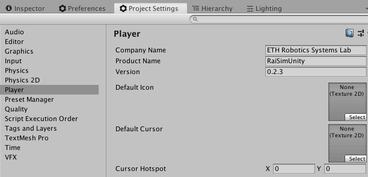

# Contributing to RaiSimUnity 

## Styleguides

This styleguides are inspired by [Atom](https://github.com/atom/atom/blob/master/CONTRIBUTING.md).

### Git Commit Messages

- Use the present tense ("Add feature" not "Added feature")
- Start with a capital letter

## Release guideline

- Create a git tag e.g. ```v1.0.0```
- Keep [CHANGELOG.md](CHANGELOG.md) updated before release
- Update version number on Unity Editor
    - Project Settings > Player > Versions
    


