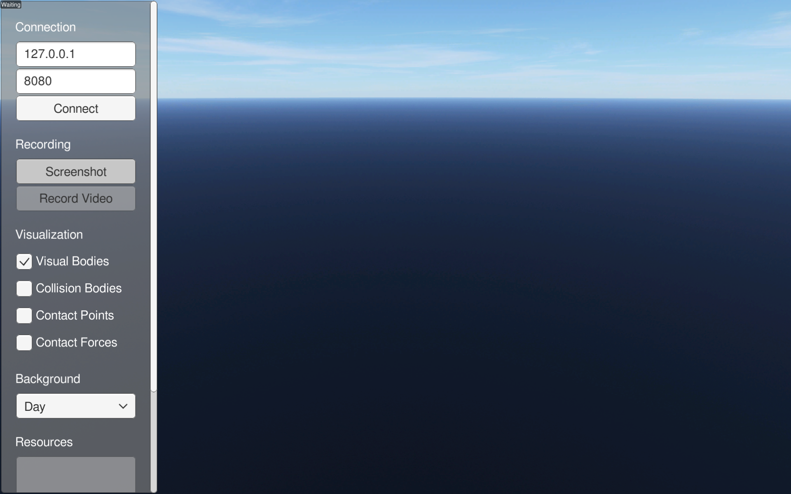
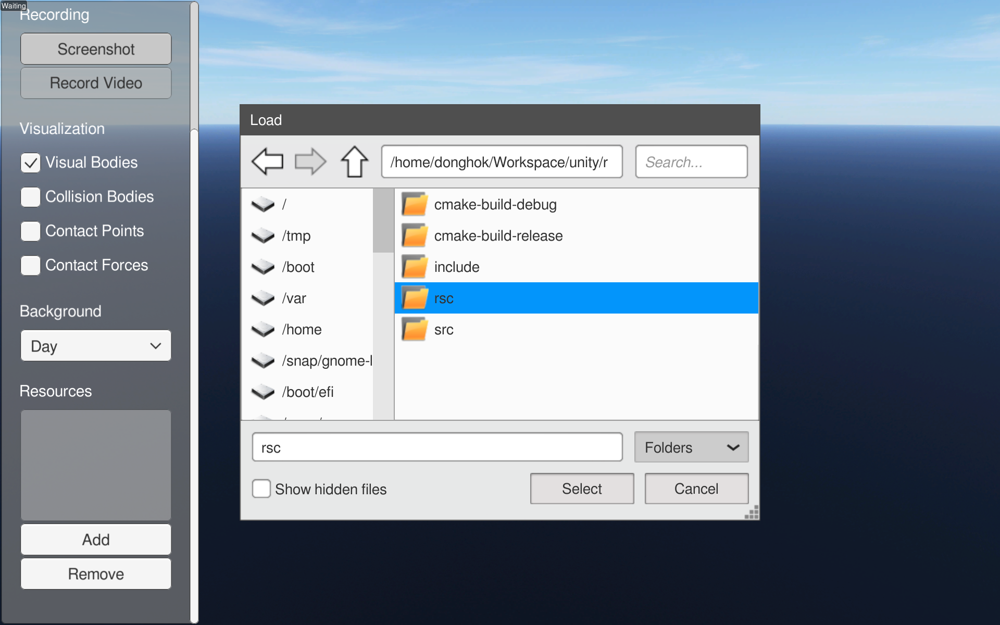
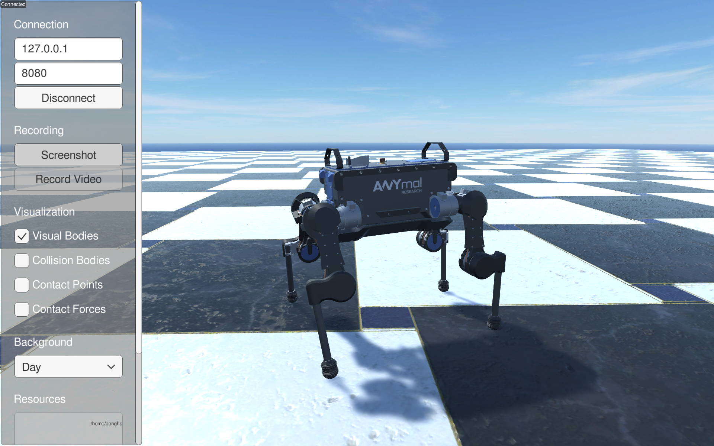
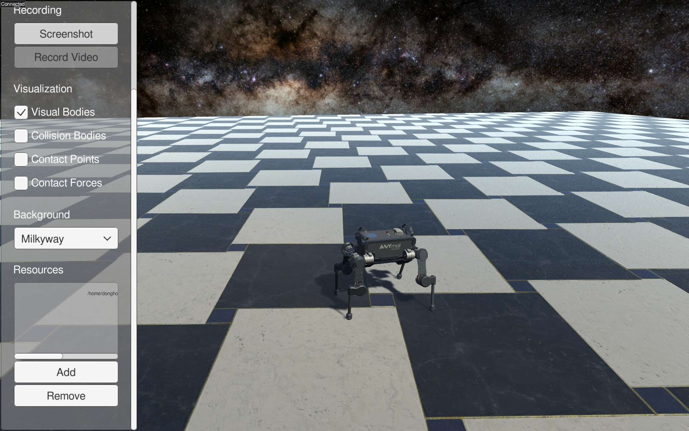
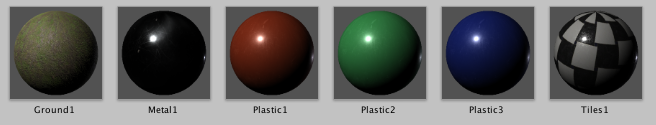

# RaiSimUnity (NOT COMPLETED) 


 
RaiSimUnity is a visualizer for RaiSim based on [Unity](https://unity.com/). It gets the simulation data from raisim server application via TCP/IP.

The project was tested on Ubuntu 18.04 LST.

## Dependencies

The following Unity plugins are already included in the project.                
- [SimpleFileBrowser](https://assetstore.unity.com/packages/tools/gui/runtime-file-browser-113006)

The following Unity packages are imported by Unity Package Manager automatically: see [Packages/manifest.json](Packages/manifest.json) 
- [UnityMeshImporter](https://github.com/eastskykang/UnityMeshImporter)

- minizip ```sudo apt install minizip```

The followings are optional dependencies
- [ffmpeg](https://www.ffmpeg.org/) for video recording
    - You can install ffmpeg by 
        ```sh
        $ sudo apt install ffmpeg
        ``` 

## How to 

### Using RaiSimUnity

For beginners, we recommend downloading a compiled app image from the [release tab](https://github.com/leggedrobotics/RaiSimUnity/releases). 
This is stand-alone application thus you don't have to mind about dependencies or compiling. (only ffmpeg is required for recording a screen capture video.)

### Quickstart with RaiSim

1. Add the following line in your RaiSim simulation code: see [Example code](https://github.com/leggedrobotics/raisimUnity/tree/master/Examples/src)
    ```cpp
      /// launch raisim server
      raisim::RaisimServer server(&world);
      server.launchServer();
    
      while(1) {
        raisim::MSLEEP(2);
        server.integrateWorldThreadSafe();
      }
    
      server.killServer();
    ```
2. Run your RaiSim simulation. 
3. Run RaiSimUnity application.

4. Add your resource directory that contains your mesh, material etc.

5. Tap *Connect* button after specify TCP address and port.

6. You can change background by *Background* dropdown menu in run time.


### Development

The following sections introduces how to develop RaiSimUnity on Linux (Ubuntu 18.04 LTS). For more details, see [Installation wiki](https://github.com/leggedrobotics/RaiSimUnity/wiki/installation) and [Developing wiki](https://github.com/leggedrobotics/RaiSimUnity/wiki/developing).

#### Getting started

1. Clone this repository with git and [git-lfs](https://git-lfs.github.com/): we use git-lfs for large files such as materials, meshes, texture images etc.
    ```sh
    $ git clone https://github.com/eastskykang/RaiSimUnity.git
    ```
2. Once you cloned source code, get lfs files by 
    ```sh
    $ git lfs pull origin
    ```
    You should see texture JPEG files properly from ```Assets/Resources/texture/cc0/```. 
3. Open the project by Unity Editor >= 2019.2.9
    - You can get Unity Editor for Linux from [Unity Hub for Linux](https://forum.unity.com/threads/unity-hub-v2-0-0-release.677485/?_ga=2.133515342.19804957.1574080929-125858921.1570536365)
    - Once you open the project, [UnityMeshImporter - com.donghok.meshimporter](https://github.com/eastskykang/UnityMeshImporter) is imported automatically.  
4. Write or edit Unity project with Unity Editor and your code editor 
    - We strongly recommend to use JetBrain's Rider IDE and Unity Rider Editor package >= 1.1.2 for programming or debugging. See [this](https://github.com/leggedrobotics/RaiSimUnity/wiki/developing#rider-ide-optional) for more details.

#### Contribution guideline

See a [contribution guideline](CONTRIBUTING.md).

## Material supports

RaiSimUnity has default materials created from [CC0 textures](https://cc0textures.com/) and [Free PBR Materials](https://freepbr.com/) textures.
[Default materials](Assets/Resources/materials/Resources) are included as Resources. You can use default materials as follows: 

```cs
Material material = Resources.Load<Material>(yourMaterialName);
yourGameObject.GetComponentInChildren<Renderer>().material = material;
```

The name of default materials are: 
- ```Ground1```: default material for height map
- ```Tiles1```: default material for plane 
- ```Plastic1```: red plastic
- ```Plastic2```: green plastic
- ```Plastic3```: blue plastic
- ```Metal1```



If you want to create your own material, see [Wiki doc](https://github.com/leggedrobotics/RaiSimUnity/wiki/creating-unity-materials).

Note that material defined in Collada format (.dae) can be automatically imported without pre-created Unity material. 

## FAQ

- Is RaiSimUnity a stand-alone simulator? 
    - No, RaiSimUnity is a TCP client of [RaiSim](https://github.com/leggedrobotics/raisimLib).
- Is RaiSimUnity open-sourced?
    - Yes. However note that RaiSim is not open-sourced project. 
- Can RaiSim and RaiSimUnity be run on different machines? 
    - Yes. You can run RaiSim application on your "Server" machine and connect RaiSimUnity to the server by specifying IP address. 
- Does RaiSimUnity support Mac or Windows?
    - Although we only release Linux builds, you can easily build RaiSimUnity for Mac or Windows. 
    - However RaiSim does not support Mac or Windows. This means if you want to use RaiSimUnity on Mac or Windows, you need to run your RaiSim application on Linux "Server" machine (or docker container) and connect it with RaiSimUnity. 
